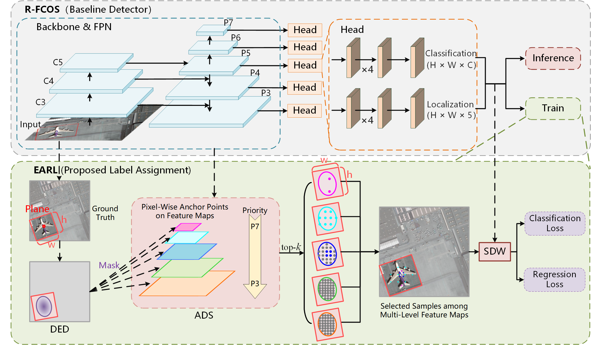
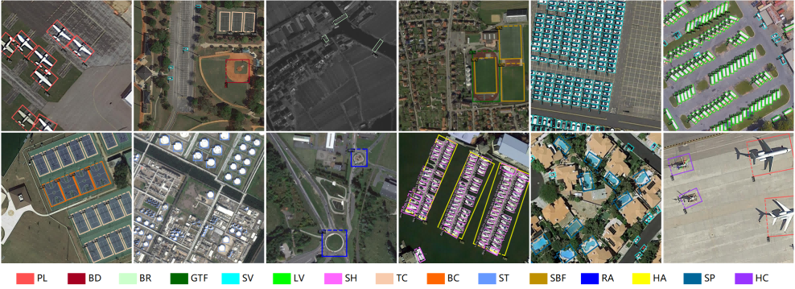

# EARL: An Elliptical Distribution aided Adaptive Rotation Label Assignment for Oriented Object Detection in Remote Sensing Images

> [[Arxiv Preprint](https://arxiv.org/abs/2301.05856)] ✨
> [[IEEE TGRS](https://ieeexplore.ieee.org/document/10238752)] ✨

# Abstract

Label assignment is a crucial process in object detection, which significantly influences the detection performance by determining positive or negative samples during training process. However, existing label assignment strategies barely consider the characteristics of targets in remote sensing images (RSIs) thoroughly, e.g., large variations in scales and aspect ratios, leading to insufficient and imbalanced sampling and introducing more low-quality samples, thereby limiting detection performance. To solve the above problems, an Elliptical Distribution aided Adaptive Rotation Label Assignment (EARL) is proposed to select high-quality positive samples adaptively in anchor-free detectors. Specifically, an adaptive scale sampling (ADS) strategy is presented to select samples adaptively among multi-level feature maps according to the scales of targets, which achieves sufficient sampling with more balanced scale-level sample distribution. In addition, a dynamic elliptical distribution aided sampling (DED) strategy is proposed to make the sample distribution more flexible to fit the shapes and orientations of targets, and filter out low-quality samples. Furthermore, a spatial distance weighting (SDW) module is introduced to integrate the adaptive distance weighting into loss function, which makes the detector more focused on the high-quality samples. Extensive experiments on several popular datasets demonstrate the effectiveness and superiority of our proposed EARL, where without bells and whistles, it can be easily applied to different detectors and achieve state-of-the-art performance. The source code will be available at: [https://github.com/Justlovesmile/EARL](https://github.com/Justlovesmile/EARL).





# Get Started

## 1. Installation

EARL depends on [Detectron2](https://github.com/facebookresearch/detectron2) and [MMRotate](https://github.com/open-mmlab/mmrotate). Below are quick steps for installation. Please refer to [https://detectron2.readthedocs.io/en/latest/](https://detectron2.readthedocs.io/en/latest/) and [https://mmrotate.readthedocs.io/en/latest/](https://mmrotate.readthedocs.io/en/latest/) for more detailed installation instruction.

```shell
# detectron2
git clone https://github.com/facebookresearch/detectron2.git
python -m pip install -e detectron2

# mmrotate v1.0.0rc1
pip install -U openmim
mim install mmengine
mim install "mmcv>=2.0.0rc1"
mim install "mmdet>=3.0.0rc0"
git clone -b v1.0.0rc1 https://github.com/open-mmlab/mmrotate.git
cd mmrotate
pip install -v -e .
```

Some functions may depend on [DOTA_devkit](https://github.com/CAPTAIN-WHU/DOTA_devkit) and [detectron2-GradCAM](https://github.com/alexriedel1/detectron2-GradCAM). Below are quick steps for installation.

```shell
# DOTA_devkit
git clone git@github.com:CAPTAIN-WHU/DOTA_devkit.git
cd DOTA_devkit
sudo apt-get install swig
swig -c++ -python polyiou.i
python setup.py build_ext --inplace

# detectron2-GradCAM
git clone git@github.com:alexriedel1/detectron2-GradCAM.git
```

## 2. Datasets

1. DOTA dataset can be downloaded from [https://captain-whu.github.io/DOTA/dataset.html](https://captain-whu.github.io/DOTA/dataset.html). The development kit, i.e., [DOTA_devkit](https://github.com/CAPTAIN-WHU/DOTA_devkit), can provide the function of splitting and merging images.
2. DIOR dataset can be downloaded from [https://gcheng-nwpu.github.io](https://gcheng-nwpu.github.io/#Datasets).
3. HRSC2016 dataset can be downloaded from [https://www.kaggle.com/datasets/guofeng/hrsc2016](https://www.kaggle.com/datasets/guofeng/hrsc2016).

## 3. Run

We provide some example `.sh` scripts.

# Citation

Give a ⭐️ if this project helped you. If you use it, please consider citing:

```bibtex
@ARTICLE{10238752,
  author={Guan, Jian and Xie, Mingjie and Lin, Youtian and He, Guangjun and Feng, Pengming},
  journal={IEEE Transactions on Geoscience and Remote Sensing}, 
  title={EARL: An Elliptical Distribution Aided Adaptive Rotation Label Assignment for Oriented Object Detection in Remote Sensing Images}, 
  year={2023},
  volume={61},
  number={},
  pages={1-15},
  doi={10.1109/TGRS.2023.3311416}}
```
